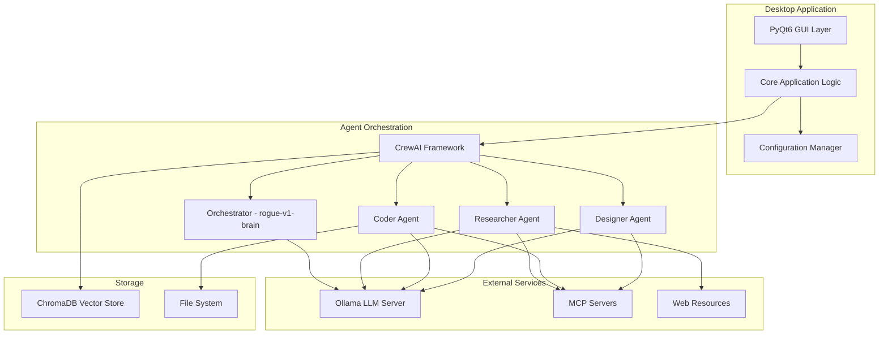

# Design Document - AURA Desktop Application

AURA (Autonomous Unit & Resource Arbitrator) is a modular desktop application built with multi-agent architecture that enables users to communicate with an AI agent orchestration system through an intuitive chat interface. The system uses CrewAI for agent management, Ollama for local LLM model handling, and ChromaDB for long-term memory.

## Architecture



## Modular Structure

```text
aura_project/
├── config/
│   ├── __init__.py
│   ├── settings.py          # Central configuration manager
│   ├── default_config.yaml  # Default settings
│   └── themes/              # GUI themes
│       ├── dark.yaml
│       ├── light.yaml
│       └── custom.yaml
├── core/
│   ├── __init__.py
│   ├── application.py       # Main application logic
│   └── event_manager.py     # Event system
├── agents/
│   ├── __init__.py
│   ├── base_agent.py        # Base agent class
│   ├── researcher.py        # Researcher Agent
│   ├── coder.py            # Coder Agent
│   └── designer.py         # Designer Agent
├── tools/
│   ├── __init__.py
│   ├── base_tool.py        # Base tool class
│   ├── file_tools.py       # File tools
│   ├── web_tools.py        # Web tools
│   └── mcp_tools.py        # MCP integration
├── memory/
│   ├── __init__.py
│   ├── vector_store.py     # ChromaDB integration
│   └── memory_manager.py   # Memory manager
├── gui/
│   ├── __init__.py
│   ├── main_window.py      # Main window
│   ├── chat_widget.py      # Chat widget
│   ├── settings_panel.py   # Advanced settings panel
│   ├── theme_manager.py    # Theme manager
│   ├── animation_manager.py # Animation manager
│   ├── components/         # UI components
│   │   ├── __init__.py
│   │   ├── progress_widgets.py
│   │   ├── agent_status.py
│   │   ├── tool_indicators.py
│   │   ├── notification_system.py
│   │   └── modern_controls.py
│   └── styles/             # CSS/QSS styles
│       ├── dark_theme.qss
│       ├── light_theme.qss
│       └── animations.qss
├── integrations/
│   ├── __init__.py
│   ├── ollama_client.py    # Ollama client
│   └── mcp_client.py       # MCP client
├── utils/
│   ├── __init__.py
│   ├── logging.py          # Logging system
│   └── validators.py       # Validators
├── assets/                 # Graphic resources
│   ├── icons/
│   ├── fonts/
│   └── animations/
├── main.py                 # Application entry point
└── requirements.txt        # Dependencies
```

## Components and Interfaces

### 1. Configuration Manager

**Location:** `config/settings.py`

**Responsibility:** Central management of all application settings

**Key functions:**

- Loading configuration from YAML file
- Automatic detection of configuration changes
- Settings validation
- Providing settings to all modules

**Interface:**

```python
class ConfigManager:
    def get(self, key: str, default=None) -> Any
    def set(self, key: str, value: Any) -> None
    def reload(self) -> None
    def validate(self) -> bool
    def get_section(self, section: str) -> Dict[str, Any]
```

---

### 2. Core Application Logic

**Location:** `core/application.py`

**Responsibility:** Main application logic, coordination between components

**Key functions:**

- Initialization of all components
- Application lifecycle management
- Coordination of communication between layers
- Application-level error handling

**Interface:**

```python
class AuraApplication:
    def initialize(self) -> None
    def start(self) -> None
    def shutdown(self) -> None
    def process_user_request(self, request: str) -> str
    def get_status(self) -> Dict[str, Any]
```

---

### 3. Agent System

**Location:** `agents/`

**Responsibility:** Implementation of agent system using CrewAI

**Agent architecture:**

#### Base Agent

```python
class BaseAgent:
    def __init__(self, config: Dict[str, Any])
    def setup_tools(self) -> List[Tool]
    def execute_task(self, task: Task) -> TaskResult
    def get_capabilities(self) -> List[str]
```

#### Orchestrator (Manager in CrewAI)

- **Model:** rogue-v1-brain
- **Role:** Management and coordination of other agents
- **Tools:** Memory tools, MCP tools
- **Process:** Hierarchical process in CrewAI

#### Researcher Agent

- **Model:** rogue-v1-agent
- **Role:** Information search and aggregation
- **Tools:** Web scraping, search engines, MCP brave search, other MCP tools
- **Specialization:** Data analysis, internet research

#### Coder Agent

- **Model:** rogue-v1-agent
- **Role:** Code creation and management
- **Tools:** File system, terminal, MCP context7, other MCP tools
- **Specialization:** Programming, debugging, file management

#### Designer Agent

- **Model:** rogue-v1-agent
- **Role:** Solution planning and design
- **Tools:** Memory tools, MCP tools
- **Specialization:** System architecture, task planning

---

### 4. Tool System

**Location:** `tools/`

**Responsibility:** Modular tool system for agents

**Tool architecture:**

#### Base Tool Interface

```python
class BaseTool:
    def __init__(self, config: Dict[str, Any])
    def execute(self, *args, **kwargs) -> ToolResult
    def validate_input(self, *args, **kwargs) -> bool
    def get_description(self) -> str
    def get_schema(self) -> Dict[str, Any]
```

#### File Tools

- File system operations (read, write, list, copy, delete, find, move, etc.)
- Directory management
- Security validation
- Path sanitization

#### Web Tools

- Playwright realtime automation, web scraping
- DuckDuckGo search
- Web content extraction and processing
- Content cleaning and processing
- Rate limiting and caching

#### MCP Tools

- Dynamic MCP server discovery
- Tool registration and execution
- Error handling and fallbacks
- Security validation

---

### 5. Memory System

**Location:** `memory/`

**Responsibility:** Management of long-term and short-term memory

**Components:**

#### Vector Store Manager

```python
class VectorStoreManager:
    def __init__(self, config: Dict[str, Any])
    def add_memory(self, text: str, metadata: Dict = None) -> str
    def search_memory(self, query: str, k: int = 5) -> List[MemoryResult]
    def delete_memory(self, memory_id: str) -> bool
    def get_statistics(self) -> Dict[str, Any]
```

#### Memory Manager

- Automatic context management
- Compression of long conversations
- Memory categorization
- Garbage collection for old data

---

### 6. GUI Layer

**Location:** `gui/`

**Responsibility:** Modern user interface using PyQt6

**GUI Architecture:**

#### Main Window

- Modern dark theme with customizable colors
- Smooth animations and transitions
- Responsive layout management
- Advanced menu system with icons
- Animated status bar with progress indicators
- Window state management with smooth resizing

#### Chat Widget

- Real-time message display with typing animations
- Rich text formatting with syntax highlighting
- Tool usage indicators with animated icons
- Progress bars for long-running operations
- Agent activity visualization
- Message bubbles with smooth fade-in effects
- Auto-scroll with smooth scrolling animation

#### Advanced Settings Panel

- Tabbed interface for different setting categories
- Real-time configuration validation
- Live preview of changes
- Search functionality for settings
- Import/export configuration profiles
- Reset to defaults with confirmation dialogs
- Tooltips and help text for all options

#### Components

- Animated progress indicators with smooth transitions
- Modern toggle switches and sliders
- Floating action buttons with hover effects
- Notification system with slide-in animations
- Agent status cards with real-time updates
- Interactive log viewers with filtering
- Collapsible panels with smooth expand/collapse
- Loading spinners and skeleton screens

#### Theme System

```python
class ThemeManager:
    def load_theme(self, theme_name: str) -> None
    def apply_animations(self, widget: QWidget) -> None
    def get_color_palette(self) -> Dict[str, str]
    def set_custom_colors(self, colors: Dict[str, str]) -> None
```

#### Animation System

```python
class AnimationManager:
    def fade_in(self, widget: QWidget, duration: int = 300) -> None
    def slide_in(self, widget: QWidget, direction: str = "left") -> None
    def smooth_scroll(self, scroll_area: QScrollArea, target: int) -> None
    def progress_animation(self, progress_bar: QProgressBar) -> None
```

---

### 7. Integration Layer

**Location:** `integrations/`

**Responsibility:** Integration with external services

#### Ollama Client

```python
class OllamaClient:
    def __init__(self, config: Dict[str, Any])
    def check_connection(self) -> bool
    def list_models(self) -> List[str]
    def generate(self, model: str, prompt: str) -> str
    def get_model_info(self, model: str) -> Dict[str, Any]
```

#### MCP Client

```python
class MCPClient:
    def __init__(self, config: Dict[str, Any])
    def discover_servers(self) -> List[MCPServer]
    def connect_to_server(self, server_config: Dict) -> MCPConnection
    def list_tools(self, server: str) -> List[MCPTool]
    def execute_tool(self, server: str, tool: str, params: Dict) -> Any
```

## Data Models

### Configuration Schema

---

```yaml
# default_config.yaml
application:
  name: "AURA"
  version: "1.0.0"
  debug: false
  log_level: "INFO"

ollama:
  host: "localhost"
  port: 11434
  orchestrator_model: "rogue-v1-brain"
  agent_model: "rogue-v1-agent"
  timeout: 30

memory:
  vector_store:
    type: "chromadb"
    path: "./data/chroma_db"
    collection_name: "aura_memory"
  context_window: 8000
  max_memories: 10000

agents:
  researcher:
    enabled: true
    max_search_results: 10
    web_timeout: 30
  coder:
    enabled: true
    safe_mode: true
    allowed_paths: ["./workspace", "./projects"]
  designer:
    enabled: true
    planning_depth: 3

mcp:
  enabled: true
  auto_discover: true
  servers: []
  timeout: 15

gui:
  theme:
    name: "dark"
    primary_color: "#2D3748"
    secondary_color: "#4A5568"
    accent_color: "#63B3ED"
    text_color: "#E2E8F0"
    background_color: "#1A202C"
    success_color: "#48BB78"
    warning_color: "#ED8936"
    error_color: "#F56565"
  window:
    size: [1400, 900]
    min_size: [800, 600]
    resizable: true
    center_on_screen: true
  fonts:
    primary: "Segoe UI"
    monospace: "Consolas"
    size: 12
    scaling: 1.0
  animations:
    enabled: true
    duration: 300
    easing: "ease_in_out"
  chat:
    auto_scroll: true
    smooth_scrolling: true
    show_timestamps: true
    show_agent_avatars: true
    typing_indicator: true
    message_animations: true
  settings:
    show_advanced: false
    live_preview: true
    search_enabled: true
    categories_expanded: false

security:
  sandbox_mode: true
  require_confirmation: true
  allowed_operations: ["read", "write", "search"]
```

## Task Flow Model

```python
@dataclass
class TaskRequest:
    id: str
    user_input: str
    timestamp: datetime
    priority: int = 1

@dataclass
class TaskStep:
    id: str
    agent: str
    description: str
    dependencies: List[str]
    status: TaskStatus
    result: Optional[str] = None

@dataclass
class TaskResult:
    task_id: str
    success: bool
    result: str
    execution_time: float
    agent_logs: List[str]
```

## Memory Model

```python
@dataclass
class MemoryEntry:
    id: str
    content: str
    metadata: Dict[str, Any]
    timestamp: datetime
    category: str
    relevance_score: float = 0.0

@dataclass
class MemorySearchResult:
    entry: MemoryEntry
    similarity_score: float
    context: str
```

## Error Handling

### Error Categories

1. **Configuration Errors**

   - Invalid configuration files
   - Missing required settings
   - Type validation errors

2. **Connection Errors**

   - Ollama server unavailable
   - MCP server connection failures
   - Network timeouts

3. **Agent Execution Errors**

   - Task execution failures
   - Tool execution errors
   - Model response errors

4. **Security Errors**
   - Unauthorized file access
   - Dangerous command execution
   - MCP security violations

### Error Handling Strategy

```python
class ErrorHandler:
    def handle_configuration_error(self, error: ConfigError) -> None
    def handle_connection_error(self, error: ConnectionError) -> None
    def handle_agent_error(self, error: AgentError) -> None
    def handle_security_error(self, error: SecurityError) -> None
    def log_error(self, error: Exception, context: Dict) -> None
```

### Recovery Mechanisms

- **Graceful Degradation:** System continues with limited functionality
- **Automatic Retry:** Configurable retry logic for transient errors
- **Fallback Options:** Alternative tools/agents when primary fails
- **User Notification:** Clear error messages with suggested actions

## Testing Strategy

### Unit Testing

- **Coverage Target:** 90%+
- **Framework:** pytest
- **Mock Strategy:** Mock external dependencies (Ollama, MCP, web)
- **Test Categories:**
  - Configuration management
  - Agent logic
  - Tool execution
  - Memory operations
  - GUI components

### Integration Testing

- **Agent Coordination:** Test CrewAI workflow execution
- **External Services:** Test Ollama and MCP integration
- **End-to-End:** Complete user request processing
- **Performance:** Response time and resource usage

### Security Testing

- **Input Validation:** Test malicious input handling
- **File System Access:** Test sandbox restrictions
- **Command Execution:** Test dangerous command prevention
- **MCP Security:** Test MCP tool validation

### Test Structure

```text
tests/
├── unit/
│   ├── test_config.py
│   ├── test_agents.py
│   ├── test_tools.py
│   ├── test_memory.py
│   └── test_gui.py
├── integration/
│   ├── test_crew_workflow.py
│   ├── test_ollama_integration.py
│   └── test_mcp_integration.py
├── security/
│   ├── test_input_validation.py
│   ├── test_file_security.py
│   └── test_command_security.py
└── fixtures/
    ├── sample_configs/
    ├── mock_responses/
    └── test_data/
```

## Performance Considerations

### Optimization Strategies

1. **Asynchronous Processing**

   - GUI remains responsive during long operations
   - Parallel agent execution where possible
   - Background memory indexing

2. **Memory Management**

   - Configurable context window limits
   - Automatic memory cleanup
   - Efficient vector storage

3. **Caching**

   - Web scraping results
   - Model responses for similar queries
   - MCP tool schemas

4. **Resource Monitoring**
   - CPU and memory usage tracking
   - Model loading optimization
   - Connection pooling

### Scalability Design

- **Modular Architecture:** Easy to add new agents/tools
- **Configuration-Driven:** Behavior modification without code changes
- **Plugin System:** Support for external extensions
- **Distributed Processing:** Future support for remote agents

## Security Architecture

### Security Layers

1. **Input Validation**

   - Sanitize all user inputs
   - Validate file paths and commands
   - Check MCP tool parameters

2. **Sandbox Environment**

   - Restrict file system access
   - Limit command execution
   - Isolate agent operations

3. **Permission System**

   - User confirmation for risky operations
   - Configurable security levels
   - Audit logging

4. **Data Protection**
   - Local data storage only
   - Encrypted sensitive configurations
   - Secure memory handling

### Security Configuration

```yaml
security:
  sandbox_mode: true
  require_confirmation: true
  allowed_paths:
    - "./workspace"
    - "./projects"
  blocked_commands:
    - "rm -rf"
    - "del /f /s /q"
    - "format"
  mcp_validation: true
  audit_logging: true
```
