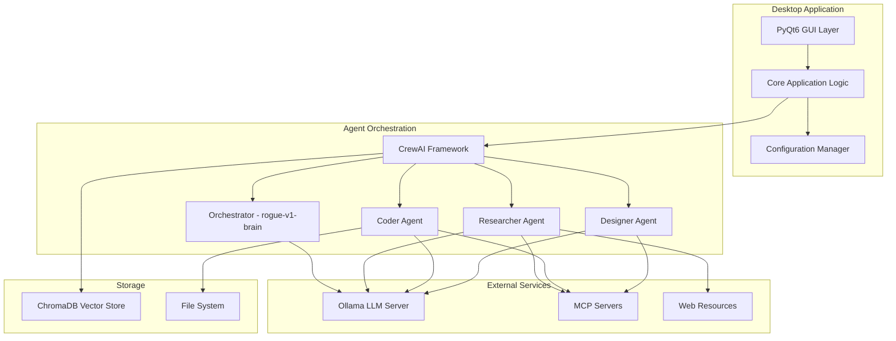

# 🌟 AURA - Autonomous Unit & Resource Arbitrator


[](https://python.org)
[](https://www.riverbankcomputing.com/software/pyqt/)
[](https://github.com/joaomdmoura/crewAI)
[](https://ollama.ai)
[](https://www.trychroma.com)

## _Inteligentny asystent desktopowy z wieloagentowym systemem AI_

[🚀 Instalacja](#-instalacja) • [📖 Dokumentacja](#-dokumentacja) • [🎯 Funkcje](#-kluczowe-funkcje) • [🏗️ Architektura](#️-architektura) • [🤝 Współpraca](#-współpraca)

---

## 📋 Spis treści

- [🌟 O projekcie](#-o-projekcie)
- [✨ Kluczowe funkcje](#-kluczowe-funkcje)
- [🏗️ Architektura](#️-architektura)
- [🚀 Instalacja](#-instalacja)
- [🎮 Szybki start](#-szybki-start)
- [📖 Dokumentacja](#-dokumentacja)
- [🔧 Konfiguracja](#-konfiguracja)
- [🧪 Testowanie](#-testowanie)
- [🤝 Współpraca](#-współpraca)

## 🌟 O projekcie

**AURA** to zaawansowana aplikacja desktopowa, która wykorzystuje wieloagentowy system AI do automatyzacji złożonych zadań. Zbudowana w architekturze modułowej, AURA łączy w sobie moc lokalnych modeli językowych z intuicyjnym interfejsem graficznym, oferując użytkownikom inteligentnego asystenta zdolnego do:

- 🔍 **Badań internetowych** i agregacji informacji
- 💻 **Zarządzania kodem** i operacji na plikach
- 🎨 **Planowania rozwiązań** i architektury systemów
- 🧠 **Zapamiętywania kontekstu** między sesjami
- 🔒 **Pracy offline** z pełną kontrolą nad danymi

## ✨ Kluczowe funkcje

### 🤖 Wieloagentowy System AI

- **Orchestrator** - zarządza i koordynuje inne agenty (model: `rogue-v1-brain`)
- **Researcher Agent** - wyszukiwanie i analiza informacji (model: `rogue-v1-agent`)
- **Coder Agent** - tworzenie i zarządzanie kodem (model: `rogue-v1-agent`)
- **Designer Agent** - planowanie i projektowanie rozwiązań (model: `rogue-v1-agent`)

### 🎨 Nowoczesny interfejs

- **PyQt6** z ciemnymi/jasnymi motywami
- **Płynne animacje** i przejścia
- **Responsywny design** z zaawansowanymi kontrolkami
- **Real-time chat** z wizualizacją postępu

### 🧠 Inteligentna pamięć

- **ChromaDB** do przechowywania wektorów
- **Długoterminowa pamięć** między sesjami
- **Semantyczne wyszukiwanie** w historii
- **Automatyczna kategoryzacja** wspomnień

### 🌐 Zaawansowane narzędzia

- **Playwright** do automatyzacji przeglądarek
- **BeautifulSoup4** do parsowania HTML
- **DuckDuckGo Search** do wyszukiwania
- **MCP Protocol** do rozszerzalności

### 🔒 Bezpieczeństwo i prywatność

- **Lokalne przetwarzanie** z Ollama
- **Tryb sandbox** dla operacji
- **Walidacja bezpieczeństwa** dla wszystkich akcji
- **Pełna kontrola nad danymi**

## 🏗️ Architektura



### 📁 Struktura projektu

```text
aura_project/
├── 📁 config/              # Zarządzanie konfiguracją
├── 📁 core/                # Logika aplikacji
├── 📁 agents/              # Implementacje agentów
├── 📁 tools/               # Narzędzia dla agentów
├── 📁 memory/              # System pamięci
├── 📁 gui/                 # Interfejs PyQt6
├── 📁 integrations/        # Integracje zewnętrzne
├── 📁 utils/               # Narzędzia pomocnicze
├── 📁 assets/              # Zasoby graficzne
├── 📁 tests/               # Testy jednostkowe i integracyjne
├── 📁 docs/                # Dokumentacja bibliotek
├── 📄 main.py              # Punkt wejścia aplikacji
├── 📄 requirements.txt     # Zależności Python
└── 📄 README.md           # Ten plik
```

## 🚀 Instalacja

### Wymagania systemowe

- **Python 3.9+**
- **Git**
- **Ollama** (do lokalnych modeli LLM)
- **8GB RAM** (zalecane 16GB)
- **GPU** (opcjonalne, dla lepszej wydajności)

### 1️⃣ Klonowanie repozytorium

```bash
git clone https://github.com/your-username/aura_project.git
cd aura_project
```

### 2️⃣ Konfiguracja środowiska

```bash
# Tworzenie środowiska wirtualnego
python -m venv aura_env

# Aktywacja środowiska
# Windows:
aura_env\Scripts\activate
# macOS/Linux:
source aura_env/bin/activate

# Instalacja zależności
pip install -r requirements.txt

# Instalacja przeglądarek dla Playwright
playwright install
```

### 3️⃣ Instalacja Ollama

```bash
# Windows (PowerShell)
iwr -useb https://ollama.ai/install.ps1 | iex

# macOS
curl -fsSL https://ollama.ai/install.sh | sh

# Linux
curl -fsSL https://ollama.ai/install.sh | sh
```

### 4️⃣ Pobieranie modeli

```bash
# Pobieranie wymaganych modeli
ollama pull rogue-v1-brain
ollama pull rogue-v1-agent
```

### 5️⃣ Konfiguracja

```bash
# Kopiowanie przykładowej konfiguracji
cp config/default_config.yaml config/local_config.yaml

# Edytuj config/local_config.yaml według potrzeb
```

## 🎮 Szybki start

### Uruchomienie aplikacji

```bash
# Aktywacja środowiska
source aura_env/bin/activate  # Linux/macOS
# lub
aura_env\Scripts\activate     # Windows

# Uruchomienie AURA
python main.py
```

### Pierwsze kroki

1. **Uruchom Ollama** w tle
2. **Otwórz AURA** - pojawi się główne okno aplikacji
3. **Napisz zapytanie** w interfejsie czatu
4. **Obserwuj pracę agentów** w czasie rzeczywistym
5. **Przeglądaj wyniki** i historię konwersacji

### Przykładowe zapytania

```text
🔍 "Znajdź najnowsze informacje o PyQt6 i podsumuj kluczowe funkcje"

💻 "Stwórz prostą aplikację Flask z endpointem API"

🎨 "Zaplanuj architekturę systemu do zarządzania zadaniami"

📊 "Przeanalizuj ten kod i zaproponuj optymalizacje"
```

## 📖 Dokumentacja

### 📚 Dokumentacja bibliotek

W folderze `docs/` znajdziesz szczegółową dokumentację wszystkich używanych bibliotek:

- [CrewAI](docs/crewai.md) - Orkiestracja agentów AI
- [LangChain](docs/langchain.md) - Framework dla aplikacji LLM
- [Playwright](docs/playwright.md) - Automatyzacja przeglądarek
- [BeautifulSoup4](docs/beautifulsoup4.md) - Parsowanie HTML/XML
- [PyQt6](docs/pyqt6.md) - Framework GUI
- [ChromaDB](docs/chromadb.md) - Baza danych wektorowych
- [Ollama](docs/ollama.md) - Lokalne modele LLM
- [Python-dotenv](docs/python-dotenv.md) - Zmienne środowiskowe
- [Ruff](docs/ruff.md) - Linter i formatter
- [Pytest](docs/pytest.md) - Framework testowy

### 🏗️ Dokumentacja architektury

- [Design Document](.kiro/specs/aura-desktop-app/design.md) - Szczegółowy opis architektury
- [Implementation Plan](.kiro/specs/aura-desktop-app/tasks.md) - Plan implementacji

## 🔧 Konfiguracja

### Podstawowa konfiguracja

```yaml
# config/local_config.yaml
application:
  name: "AURA"
  debug: false
  log_level: "INFO"

ollama:
  host: "localhost"
  port: 11434
  orchestrator_model: "rogue-v1-brain"
  agent_model: "rogue-v1-agent"

gui:
  theme:
    name: "dark"
    primary_color: "#2D3748"
    accent_color: "#63B3ED"
  window:
    size: [1400, 900]
    center_on_screen: true

security:
  sandbox_mode: true
  require_confirmation: true
```

### Zmienne środowiskowe

```bash
# .env
OLLAMA_HOST=localhost
OLLAMA_PORT=11434
DEBUG=False
LOG_LEVEL=INFO
```

## 🧪 Testowanie

### Uruchomienie testów

```bash
# Wszystkie testy
pytest

# Testy jednostkowe
pytest tests/unit/

# Testy integracyjne
pytest tests/integration/

# Testy bezpieczeństwa
pytest tests/security/

# Z pokryciem kodu
pytest --cov=aura_project --cov-report=html
```

### Linting i formatowanie

```bash
# Sprawdzenie stylu kodu
ruff check .

# Automatyczne formatowanie
ruff format .

# Sprawdzenie typów
mypy .
```

## 🤝 Współpraca

Zapraszamy do współpracy! Oto jak możesz pomóc:

### 🐛 Zgłaszanie błędów

1. Sprawdź [istniejące issues](https://github.com/your-username/aura_project/issues)
2. Utwórz nowy issue z szczegółowym opisem
3. Dołącz logi i kroki reprodukcji

### 💡 Propozycje funkcji

1. Otwórz issue z tagiem `enhancement`
2. Opisz szczegółowo proponowaną funkcję
3. Wyjaśnij przypadki użycia

### 🔧 Rozwój

1. **Fork** repozytorium
2. Utwórz **branch** dla swojej funkcji (`git checkout -b feature/amazing-feature`)
3. **Commit** zmiany (`git commit -m 'Add amazing feature'`)
4. **Push** do brancha (`git push origin feature/amazing-feature`)
5. Otwórz **Pull Request**

### 📋 Wytyczne dla deweloperów

- Używaj **Python 3.9+**
- Przestrzegaj **PEP 8** (sprawdzane przez Ruff)
- Pisz **testy** dla nowego kodu
- Aktualizuj **dokumentację**
- Używaj **type hints**

## 🛡️ Bezpieczeństwo

AURA została zaprojektowana z myślą o bezpieczeństwie:

- **Lokalne przetwarzanie** - wszystkie dane pozostają na Twoim komputerze
- **Tryb sandbox** - ograniczone uprawnienia dla operacji systemowych
- **Walidacja wejść** - wszystkie dane są sprawdzane przed przetworzeniem
- **Szyfrowanie** - wrażliwe dane są szyfrowane
- **Audyt** - wszystkie operacje są logowane

### Zgłaszanie luk bezpieczeństwa

Jeśli znajdziesz lukę bezpieczeństwa, prosimy o kontakt na: <admin@rogueagent.dev>

## 🌟 Roadmapa

### v1.0 - Podstawowa funkcjonalność

- [x] Wieloagentowy system AI
- [x] Interfejs PyQt6
- [x] Integracja z Ollama
- [x] System pamięci ChromaDB
- [ ] Pełne testy i dokumentacja

### v1.1 - Rozszerzenia

- [ ] Więcej narzędzi MCP
- [ ] Zaawansowane personalizacje GUI
- [ ] Eksport/import konfiguracji
- [ ] Wtyczki społeczności

### v2.0 - Zaawansowane funkcje

- [ ] Rozproszone przetwarzanie
- [ ] Integracja z chmurą (opcjonalna)
- [ ] Zaawansowana analityka
- [ ] API dla deweloperów

## 🙏 Podziękowania

AURA nie byłaby możliwa bez wspaniałych projektów open source:

- [CrewAI](https://github.com/joaomdmoura/crewAI) - Framework wieloagentowy
- [Ollama](https://ollama.ai) - Lokalne modele LLM
- [PyQt6](https://www.riverbankcomputing.com/software/pyqt/) - Framework GUI
- [ChromaDB](https://www.trychroma.com) - Baza danych wektorowych
- [Playwright](https://playwright.dev) - Automatyzacja przeglądarek

## 📞 Kontakt

- **Email**: <admin@rogueagent.dev>
- **Discord**:
- **GitHub**: [Issues i dyskusje](https://github.com/your-username/aura_project)

---

## **Zbudowane z ❤️ przez Ultimate Judge**

[⭐ Daj gwiazdkę](https://github.com/your-username/aura_project) • [🐛 Zgłoś błąd](https://github.com/your-username/aura_project/issues) • [💡 Zaproponuj funkcję](https://github.com/your-username/aura_project/issues/new)
