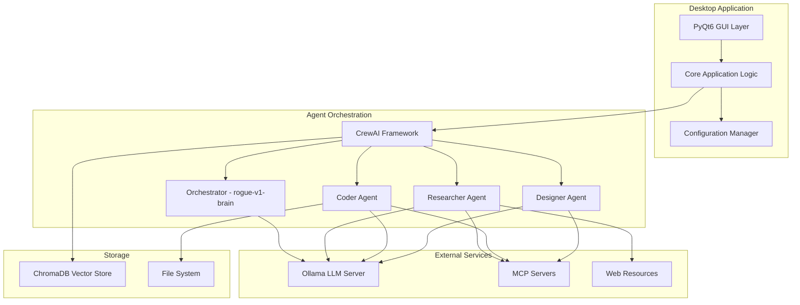

# 🌟 AURA - Autonomous Unit & Resource Arbitrator


[](https://python.org)
[](https://www.riverbankcomputing.com/software/pyqt/)
[](https://github.com/joaomdmoura/crewAI)
[](https://ollama.ai)
[](https://www.trychroma.com)

## _Intelligent desktop assistant with multi-agent AI system_

[🚀 Installation](#-installation) • [📖 Documentation](#-documentation) • [🎯 Features](#-key-features) • [🏗️ Architecture](#️-architecture) • [🤝 Contributing](#-contributing)

---

## 📋 Table of Contents

- [🌟 About the project](#-about-the-project)
- [✨ Key features](#-key-features)
- [🏗️ Architecture](#️-architecture)
- [🚀 Installation](#-installation)
- [🎮 Quick start](#-quick-start)
- [📖 Documentation](#-documentation)
- [🔧 Configuration](#-configuration)
- [🧪 Testing](#-testing)
- [🤝 Contributing](#-contributing)

## 🌟 About the project

**AURA** is an advanced desktop application that uses a multi-agent AI system to automate complex tasks. Built with modular architecture, AURA combines the power of local language models with an intuitive graphical interface, offering users an intelligent assistant capable of:

- 🔍 **Web research** and information aggregation
- 💻 **Code management** and file operations
- 🎨 **Solution planning** and system architecture
- 🧠 **Context memory** between sessions
- 🔒 **Offline operation** with full data control

## ✨ Key features

### 🤖 Multi-Agent AI System

- **Orchestrator** - manages and coordinates other agents (model: `rogue-v1-brain`)
- **Researcher Agent** - searches and analyzes information (model: `rogue-v1-agent`)
- **Coder Agent** - creates and manages code (model: `rogue-v1-agent`)
- **Designer Agent** - plans and designs solutions (model: `rogue-v1-agent`)

### 🎨 Modern interface

- **PyQt6** with dark/light themes
- **Smooth animations** and transitions
- **Responsive design** with advanced controls
- **Real-time chat** with progress visualization

### 🧠 Intelligent memory

- **ChromaDB** for vector storage
- **Long-term memory** between sessions
- **Semantic search** in history
- **Automatic categorization** of memories

### 🌐 Advanced tools

- **Playwright** for browser automation
- **BeautifulSoup4** for HTML parsing
- **DuckDuckGo Search** for searching
- **MCP Protocol** for extensibility

### 🔒 Security and privacy

- **Local processing** with Ollama
- **Sandbox mode** for operations
- **Security validation** for all actions
- **Full control over data**

## 🏗️ Architecture



### 📁 Project structure

```text
aura_project/
├── 📁 config/              # Configuration management
├── 📁 core/                # Application logic
├── 📁 agents/              # Agent implementations
├── 📁 tools/               # Agent tools
├── 📁 memory/              # Memory system
├── 📁 gui/                 # PyQt6 interface
├── 📁 integrations/        # External integrations
├── 📁 utils/               # Helper utilities
├── 📁 assets/              # Graphic resources
├── 📁 tests/               # Unit and integration tests
├── 📁 docs/                # Library documentation
├── 📄 main.py              # Application entry point
├── 📄 requirements.txt     # Python dependencies
└── 📄 README.md           # This file
```

## 🚀 Installation

### System requirements

- **Python 3.9+**
- **Git**
- **Ollama** (for local LLM models)
- **8GB RAM** (16GB recommended)
- **GPU** (optional, for better performance)

### 1️⃣ Clone repository

```bash
git clone https://github.com/your-username/aura_project.git
cd aura_project
```

### 2️⃣ Environment setup

```bash
# Create virtual environment
python -m venv aura_env

# Activate environment
# Windows:
aura_env\Scripts\activate
# macOS/Linux:
source aura_env/bin/activate

# Install dependencies
pip install -r requirements.txt

# Install browsers for Playwright
playwright install
```

### 3️⃣ Install Ollama

```bash
# Windows (PowerShell)
iwr -useb https://ollama.ai/install.ps1 | iex

# macOS
curl -fsSL https://ollama.ai/install.sh | sh

# Linux
curl -fsSL https://ollama.ai/install.sh | sh
```

### 4️⃣ Download models

```bash
# Download required models
ollama pull rogue-v1-brain
ollama pull rogue-v1-agent
```

### 5️⃣ Configuration

```bash
# Copy example configuration
cp config/default_config.yaml config/local_config.yaml

# Edit config/local_config.yaml as needed
```

## 🎮 Quick start

### Running the application

```bash
# Activate environment
source aura_env/bin/activate  # Linux/macOS
# or
aura_env\Scripts\activate     # Windows

# Run AURA
python main.py
```

### First steps

1. **Start Ollama** in the background
2. **Open AURA** - the main application window will appear
3. **Write a query** in the chat interface
4. **Watch agents work** in real-time
5. **Browse results** and conversation history

### Example queries

```text
🔍 "Find the latest information about PyQt6 and summarize key features"

💻 "Create a simple Flask application with an API endpoint"

🎨 "Plan an architecture for a task management system"

📊 "Analyze this code and suggest optimizations"
```

## 📖 Documentation

### 📚 Library documentation

In the `docs/` folder you'll find detailed documentation for all used libraries:

- [CrewAI](docs/crewai.md) - AI agent orchestration
- [LangChain](docs/langchain.md) - Framework for LLM applications
- [Playwright](docs/playwright.md) - Browser automation
- [BeautifulSoup4](docs/beautifulsoup4.md) - HTML/XML parsing
- [PyQt6](docs/pyqt6.md) - GUI framework
- [ChromaDB](docs/chromadb.md) - Vector database
- [Ollama](docs/ollama.md) - Local LLM models
- [Python-dotenv](docs/python-dotenv.md) - Environment variables
- [Ruff](docs/ruff.md) - Linter and formatter
- [Pytest](docs/pytest.md) - Testing framework

### 🏗️ Architecture documentation

- [Design Document](.kiro/specs/aura-desktop-app/design.md) - Detailed architecture description
- [Implementation Plan](.kiro/specs/aura-desktop-app/tasks.md) - Implementation plan

## 🔧 Configuration

### Basic configuration

```yaml
# config/local_config.yaml
application:
  name: "AURA"
  debug: false
  log_level: "INFO"

ollama:
  host: "localhost"
  port: 11434
  orchestrator_model: "rogue-v1-brain"
  agent_model: "rogue-v1-agent"

gui:
  theme:
    name: "dark"
    primary_color: "#2D3748"
    accent_color: "#63B3ED"
  window:
    size: [1400, 900]
    center_on_screen: true

security:
  sandbox_mode: true
  require_confirmation: true
```

### Environment variables

```bash
# .env
OLLAMA_HOST=localhost
OLLAMA_PORT=11434
DEBUG=False
LOG_LEVEL=INFO
```

## 🧪 Testing

### Running tests

```bash
# All tests
pytest

# Unit tests
pytest tests/unit/

# Integration tests
pytest tests/integration/

# Security tests
pytest tests/security/

# With code coverage
pytest --cov=aura_project --cov-report=html
```

### Linting and formatting

```bash
# Check code style
ruff check .

# Automatic formatting
ruff format .

# Type checking
mypy .
```

## 🤝 Contributing

We welcome contributions! Here's how you can help:

### 🐛 Reporting bugs

1. Check [existing issues](https://github.com/your-username/aura_project/issues)
2. Create a new issue with detailed description
3. Include logs and reproduction steps

### 💡 Feature suggestions

1. Open an issue with `enhancement` tag
2. Describe the proposed feature in detail
3. Explain use cases

### 🔧 Development

1. **Fork** the repository
2. Create a **branch** for your feature (`git checkout -b feature/amazing-feature`)
3. **Commit** changes (`git commit -m 'Add amazing feature'`)
4. **Push** to branch (`git push origin feature/amazing-feature`)
5. Open a **Pull Request**

### 📋 Developer guidelines

- Use **Python 3.9+**
- Follow **PEP 8** (checked by Ruff)
- Write **tests** for new code
- Update **documentation**
- Use **type hints**

## 🛡️ Security

AURA has been designed with security in mind:

- **Local processing** - all data stays on your computer
- **Sandbox mode** - limited permissions for system operations
- **Input validation** - all data is checked before processing
- **Encryption** - sensitive data is encrypted
- **Audit** - all operations are logged

### Virtualized Environment Recommendation

For enhanced security, it is highly recommended to run the AURA desktop application in a virtualized or containerized environment (e.g., Docker, a virtual machine). This provides an additional layer of isolation and helps to mitigate the risk of unintended system-level changes by the AI agents.

### Reporting security vulnerabilities

If you find a security vulnerability, please contact us at: <admin@rogueagent.dev>

## 🌟 Roadmap

### v1.0 - Basic functionality

- [x] Multi-agent AI system
- [x] PyQt6 interface
- [x] Ollama integration
- [x] ChromaDB memory system
- [ ] Complete tests and documentation

### v1.1 - Extensions

- [ ] More MCP tools
- [ ] Advanced GUI customizations
- [ ] Configuration export/import
- [ ] Community plugins

### v2.0 - Advanced features

- [ ] Distributed processing
- [ ] Cloud integration (optional)
- [ ] Advanced analytics
- [ ] Developer API

## 🙏 Acknowledgments

AURA wouldn't be possible without wonderful open source projects:

- [CrewAI](https://github.com/joaomdmoura/crewAI) - Multi-agent framework
- [Ollama](https://ollama.ai) - Local LLM models
- [PyQt6](https://www.riverbankcomputing.com/software/pyqt/) - GUI framework
- [ChromaDB](https://www.trychroma.com) - Vector database
- [Playwright](https://playwright.dev) - Browser automation

## 📞 Contact

- **Email**: <admin@rogueagent.dev>
- **Discord**:
- **GitHub**: [Issues and discussions](https://github.com/your-username/aura_project)

---

## **Built with ❤️ by Ultimate Judge**

[⭐ Give a star](https://github.com/your-username/aura_project) • [🐛 Report bug](https://github.com/your-username/aura_project/issues) • [💡 Suggest feature](https://github.com/your-username/aura_project/issues/new)
